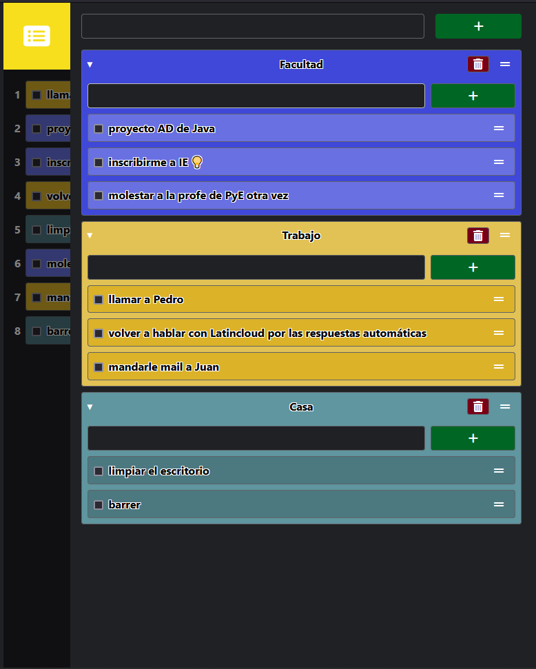
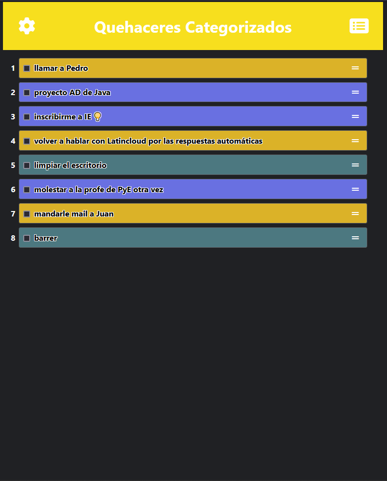
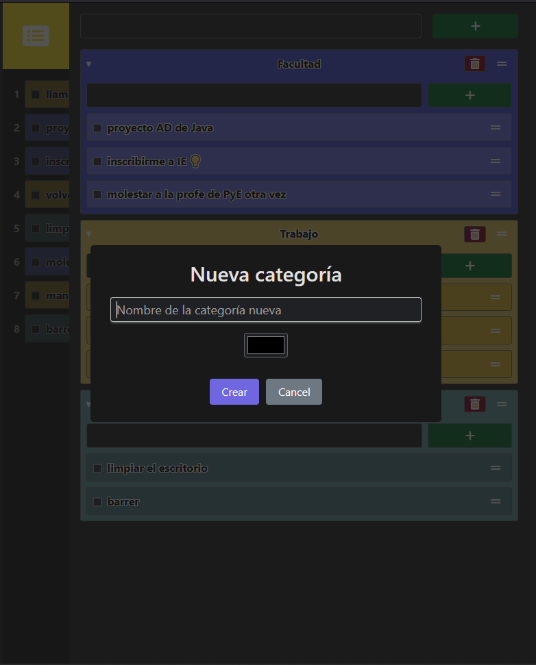

# Características

- Detecta preferencia de modo claro u oscuro
- Se puede cambiar el modo a claro u oscuro
- Se pueden crear categorías e items
- Se les puede cambiar el nombre inmediatamente en cualquier momento simplemente modificando el elemento
- Se pueden arrastrar para cambiar el orden
- Se pueden sumar a una lista común, arrastrando también
- Se pueden marcar items como terminados
- Se pueden eliminar
- Se pueden exportar e importar los datos
- Los datos se guardan automáticamente en el localStorage
- Menús hamburguesa con solo CSS 😎

## Planeado:
- Código y diseño de mayor calidad
- Botón grandote de cancelar arrastrar
- Mejorar la robustez en cuanto a seguridad, experiencia de usuario y rendimiento
- Cambiar los colores
- PWA

## Bugs conocidos:
- Editar el elemento desde la lista de TODOs no es la mejor experiencia de todas

